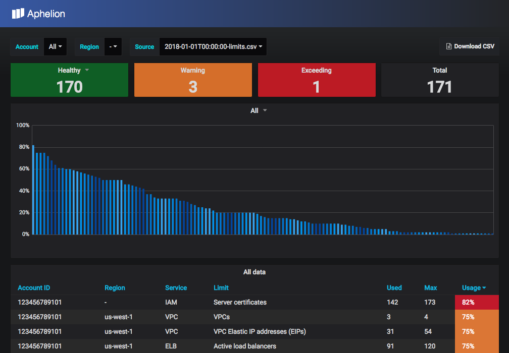

## What is Aphelion?
Aphelion is a web application that captures and visualizes your AWS services usage limits.  It continuously collects data in the background and you can visualize the data in easy-to-see graphs and charts.

## Overview
Aphelion is used to collect AWS limits across multiple accounts. It uses
a combination of Trusted Advisor (TA) as well as direct resource APIs to collect
limits for most of the AWS resources where the limit is either in TA, or
the particular service exposes the current limit values via API calls.

## Features
- View dashboard with limits and usage for all of your AWS accounts
- Filter dashboard display by Account number
- Filter dashboard display by Region
- Highlight services that are reaching max limit
  - Healthy <75%
  - Warning >=75% & <80%
  - Danger >=80%
- Download CSV report

## Documentation
- [Overview](docs/index.md)
- [AWS IAM Role Setup](docs/AWS-Setup.md)
- [Local Setup](docs/Local-Setup.md)
- [Deploy](docs/Deploy.md)
- [Troubleshooting](docs/Troubleshooting.md)
