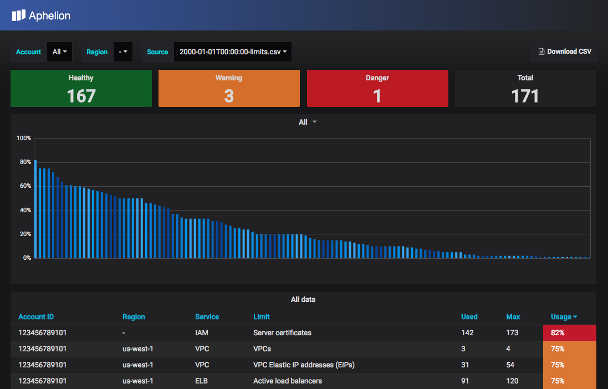

# Introduction

## What is Aphelion?
Aphelion is a dashboard to visualize AWS service limits usage for your AWS accounts

## Overview
Aphelion is used to collect AWS limits across multiple accounts. It uses
a combination of Trusted Advisor (TA) as well as direct resource APIs to collect
limits for most of the AWS resources where the limit is either in TA, or
the particular service exposes the current limit values via API calls.

## Features
* View dashboard with limits and usage for all of your AWS accounts
* Filter dashboard display by Account number
* Filter dashboard display by Region
* Highlight services that are reaching max limit
  * Healthy <75%
  * Warning >=75% & <80%
  * Danger >=80%
* Download CSV report
* Email CSV report after reaching a configurable limit
